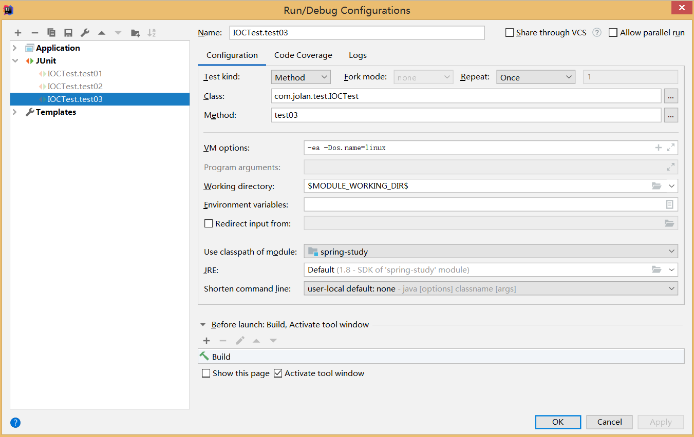

# 导入spring核心包

​	浏览器打开https://mvnrepository.com/，搜索spring context，找到相应版本点击进入，即可找到对应的maven依赖。

```xml
<!-- https://mvnrepository.com/artifact/org.springframework/spring-context -->
<dependency>
    <groupId>org.springframework</groupId>
    <artifactId>spring-context</artifactId>
    <version>5.2.6.RELEASE</version>
</dependency>
```

# xml定义bean

## 创建person类（略）

## 创建xml文件

``` xml
<?xml version="1.0" encoding="UTF-8"?>
<beans xmlns="http://www.springframework.org/schema/beans"
       xmlns:xsi="http://www.w3.org/2001/XMLSchema-instance"
       xsi:schemaLocation="http://www.springframework.org/schema/beans http://www.springframework.org/schema/beans/spring-beans.xsd">

    <bean id = "person" class = "com.jolan.bean.Person">
        <property name="name" value="zhangsan"></property>
        <property name="age" value="18"></property>
    </bean>
</beans>
```

## 创建测试类并运行

```java
public class MainTest {
    public static void main(String[] args) {
        ApplicationContext applcationContext = new ClassPathXmlApplicationContext("beans.xml");
        Person bean = (Person)applcationContext.getBean("person");
        System.out.println(bean);
    }
}
```

## 运行结果

```json
Person{name='zhangsan', age=18}
```

# 使用配置类

## 创建配置类

```java
/**
 * @author jolan80
 * @date 2020-08-08 15:25
 *
 * 配置类 = 配置文件
 */
@Configuration//告诉Spring这是一个配置类
public class MainConfig {
    //给容器中注册一个bean;类型为返回值的类型;id默认是方法名
    @Bean
    public Person person(){
        return new Person("lisi", 20);
    }
}
```

## 创建测试类并运行

```java
ApplicationContext applicationContext = new AnnotationConfigApplicationContext(MainConfig.class);
Person bean = (Person)applicationContext.getBean(Person.class);
System.out.println(bean);
String[] names = applicationContext.getBeanNamesForType(Person.class);
for (String name : names) {
    System.out.println(name);
}
```

## 运行结果

```json
Person{name='lisi', age=20}
person
```

## 修改注册容器中的beanid

### 方法一

​		修改被@Bean注解的方法名称

### 方法二

​		在@Bean注解上修改，如@Bean("person").

# 使用xml方式配置包扫描

```xml
<!-- 包扫描：只要标注了@Controller、@Service、@Respositry、@Compoment，会被自动扫描加入配置中 -->
<context:component-scan base-package="com.jolan"></context:component-scan>
```

# 使用配置类做包扫描

## 创建配置类		

​		使用注解@ComponentScan

```java
@Configuration//告诉Spring这是一个配置类
@ComponentScan(value="com.jolan")
public class MainConfig {
    //给容器中注册一个bean;类型为返回值的类型;id默认是方法名
    @Bean
    public Person person(){
        return new Person("lisi", 20);
    }
}
```

## 创建bean

​		分别创建BookContoller,BookService,BookDao，并且分别用@Controller，@Service，@Repository标签注解。

## 创建测试类

```java
@SuppressWarnings("resource")
    @Test
    public void test01(){
        AnnotationConfigApplicationContext applicationContext = new AnnotationConfigApplicationContext(MainConfig.class);
        String[] names = applicationContext.getBeanDefinitionNames();
        for (String name : names) {
            System.out.println(name);
        }
    }
```

## 运行结果

```xml
org.springframework.context.annotation.internalConfigurationAnnotationProcessor
org.springframework.context.annotation.internalAutowiredAnnotationProcessor
org.springframework.context.annotation.internalCommonAnnotationProcessor
org.springframework.context.event.internalEventListenerProcessor
org.springframework.context.event.internalEventListenerFactory
mainConfig
bookController
bookDao
bookService
person
```

​		除了spring自身的组件外，还有我们自己定义的几个bean。

## 包扫描排除

​		排除使用@Controller和@Service注解的bean。

```java
@ComponentScan(value="com.jolan", excludeFilters = {
        @ComponentScan.Filter(type = FilterType.ANNOTATION, classes = {Controller.class, Service.class})
})
```

​		测试结果如下。

```java
org.springframework.context.annotation.internalConfigurationAnnotationProcessor
org.springframework.context.annotation.internalAutowiredAnnotationProcessor
org.springframework.context.annotation.internalCommonAnnotationProcessor
org.springframework.context.event.internalEventListenerProcessor
org.springframework.context.event.internalEventListenerFactory
mainConfig
bookDao
```

## 包扫描包含

​		只包含@Controller注解的bean。注意修改useDefaultFilters属性，该属性默认是扫描所有，当该属性值为false时includeFilters才能生效。

```java
@ComponentScan(value="com.jolan", includeFilters = {
        @ComponentScan.Filter(type = FilterType.ANNOTATION, classes = {Controller.class})
}, useDefaultFilters = false)
```

## 包扫描数组

​		包扫描注解@ComponentScan是可重复使用的注解，或者使用@ComponentScans数组，其中可以配置多个@ComponentScan包扫描规则。

```java
@ComponentScans(
        value = {
                @ComponentScan(value="com.jolan", includeFilters = {
                        @ComponentScan.Filter(type = FilterType.ANNOTATION, classes = {Controller.class})
                }, useDefaultFilters = false)
        }
)
```

## 其他包扫描过滤规则

​		上面的例子中介绍了按照注解类型进行包扫描的过滤，下面介绍其他的几种规则。

### 按照给定类型过滤

​		按照指定的类型过滤使用FilterType.ASSIGNABLE_TYPE进行指定。如下所示，在原来的基础上，增加了BookService类型。

```java
@ComponentScans(
        value = {
                @ComponentScan(value="com.jolan", includeFilters = {
                        @ComponentScan.Filter(type = FilterType.ANNOTATION, classes = {Controller.class}),
                        @ComponentScan.Filter(type = FilterType.ASSIGNABLE_TYPE, classes = {BookService.class})
                }, useDefaultFilters = false)
        }
)
```

​		运行结果如下（忽略spring自身的组件），可以看到增加了bookService的bean组件。

```java
mainConfig
bookController
bookService
person
```

### 按ASPECTJ表达式过滤

​		使用较少，不介绍。

### 按则表达式过滤

​		使用较少，不介绍。

### 自定义过滤类型

#### 创建过滤类

​		自定义的过滤类，需要实现TypeFilter接口。

```java
public class MyTypeFilter implements TypeFilter {
    /**
     * metadataReader ： 读取到的当前正在扫描的类信息
     * metadataReaderFactory ： 可以获取到其他任何类信息的工厂
     *
     **/
    public boolean match(MetadataReader metadataReader, MetadataReaderFactory metadataReaderFactory) throws IOException {
        //获取当前类注解的信息
        AnnotationMetadata annotationMetadata = metadataReader.getAnnotationMetadata();
        //获取当前正在扫描的类信息
        ClassMetadata classMetadata = metadataReader.getClassMetadata();
        //获取当前类的资源信息（类路径等）
        Resource resource = metadataReader.getResource();
        String className = classMetadata.getClassName();
        System.out.println("--->" + className);
        if(className.contains("er")){
            return true;
        }
        return false;
    }
}
```

#### 修改配置类

​		在配置类中，指定Filter的type值为FilterType.CUSTOM，classes数组中指定自己创建的过滤类MyTypeFilter。

```java
@ComponentScans(
        value = {
                @ComponentScan(value="com.jolan", includeFilters = {
                        @ComponentScan.Filter(type = FilterType.CUSTOM, classes = {MyTypeFilter.class})
                }, useDefaultFilters = false)
        }
)
```

#### 运行结果

```java
--->com.jolan.test.IOCTest
--->com.jolan.bean.Person
--->com.jolan.bean.com.jolan.MainTest
--->com.jolan.com.jolan.controller.BookController
--->com.jolan.com.jolan.dao.BookDao
--->com.jolan.com.jolan.service.BookService
--->com.jolan.config.MyTypeFilter
org.springframework.context.annotation.internalConfigurationAnnotationProcessor
org.springframework.context.annotation.internalAutowiredAnnotationProcessor
org.springframework.context.annotation.internalCommonAnnotationProcessor
org.springframework.context.event.internalEventListenerProcessor
org.springframework.context.event.internalEventListenerFactory
mainConfig
person
bookController
bookService
myTypeFilter
```

# 组件的作用域

## 默认

​		spring的组件默认是单实例的。

### 创建主配置文件

```java
@Configuration
public class MainConfig2 {
    //默认是单实例的
    @Bean("person")
    public Person person(){
        return new Person("zhangsan", 25);
    }
}
```

### 创建测试类

```java
@Test
    public void test02(){
        AnnotationConfigApplicationContext applicationContext = new AnnotationConfigApplicationContext(MainConfig2.class);
        String[] names = applicationContext.getBeanDefinitionNames();
        for (String name : names) {
            System.out.println(name);
        }
        Object bean1 =  applicationContext.getBean("person");
        Object bean2 =  applicationContext.getBean("person");
        System.out.println(bean1 == bean2);
    }
```

### 运行结果

```java
mainConfig2
person
true
```

### 单实例创建时机

​		ioc容器启动会调用方法创建对象放到ioc容器中。以后每次获取就直接从容器中拿。

### 懒加载

​		容器启动时不创建对象，在第一次使用bean时候再创建对象，并初始化，在后面使用过程中不再加载。使用@Lazy进行注解。懒加载只能针对单实例的作用域有效。

```java
@Bean("person")
@Lazy
public Person person(){
    return new Person("zhangsan", 25);
}
```


## 多实例

### 修改住配置文件

​		使用@Scope属性修改作用域，这里修改为prototype。

```java
@Bean("person")
    /**
     *  prototype : 多实例
     *  singleton : 单实例（默认值）
     *  request : 同一次请求创建一个实例
     *  session : 同一个session创建一个实例
     * */
    @Scope("prototype")
    public Person person(){
        return new Person("zhangsan", 25);
    }
```

### 运行结果

```java
mainConfig2
person
false
```

### 多实例创建时机

​		在每次获取对象时才会创建对象把对象加入spring容器。

# 按条件注册bean

# 容器中正常注册bean

```java
@Bean("person")
public Person person(){
    return new Person("zhangsan", 25);
}

/**
     * @Conditional : 按照一定的条件进行判断，满足条件给容器中注册bean
     *
     */
@Bean("bill")
public Person pserson01(){
    return new Person("Bill Gates", 62);
}

@Bean("linus")
public Person pserson02(){
    return new Person("linus", 48);
}
```

## 测试类

```java
@SuppressWarnings("resource")
@Test
public void test03(){
    AnnotationConfigApplicationContext applicationContext = new AnnotationConfigApplicationContext(MainConfig2.class);
    String[] namesForType = applicationContext.getBeanNamesForType(Person.class);
    for (String s : namesForType) {
        System.out.println(s);
    }
    Map<String, Person> map = applicationContext.getBeansOfType(Person.class);
    System.out.println(map);
}
```

## 运行结果

```java
person
bill
linus
{person=Person{name='zhangsan', age=25}, bill=Person{name='Bill Gates', age=62}, linus=Person{name='linus', age=48}}
```

## 创建Condition类

​		由于@Conditional中使用的是Condition类型的数组，所以需要创建实现了Condition接口的自定义类。

```java
public class LinuxCondition implements Condition {
    /**
     * ConditionContext : 判断环境能使用的上下文（环境）
     * AnnotatedTypeMetadata : 注解信息
     */
    public boolean matches(ConditionContext conditionContext, AnnotatedTypeMetadata annotatedTypeMetadata) {
        //是否为linux系统
        //1、能获取到ioc使用的beanFactory
        ConfigurableListableBeanFactory configurableListableBeanFactory = conditionContext.getBeanFactory();
        //2、获取类加载器
        ClassLoader classLoader = conditionContext.getClassLoader();
        //3、获取当前环境信息
        Environment environment = conditionContext.getEnvironment();
        //4、获取到bean定义信息
        BeanDefinitionRegistry registry = conditionContext.getRegistry();
        String osName = environment.getProperty("os.name");
        if(osName.toUpperCase().contains("Linux".toUpperCase())){
            return true;
        }
        return false;
    }
}
```

```java
public class WindowsCondition implements Condition {
    public boolean matches(ConditionContext conditionContext, AnnotatedTypeMetadata annotatedTypeMetadata) {
        //是否为windows系统
        Environment environment = conditionContext.getEnvironment();
        String osName = environment.getProperty("os.name");
        if(osName.toUpperCase().contains("windows".toUpperCase())){
            return true;
        }
        return false;
    }
}
```

​		这两个类的作用是根据操作系统判断返回true或者false，具体的业务场景可根据情况确定。

## 修改配置类

```java
/**
     * @Conditional({Conditiion}) : 按照一定的条件进行判断，满足条件给容器中注册bean
     * 如果系统是windows，给容器中注册bill
     * 如果是linux系统，给容器中注册linus
     */
    @Conditional({WindowsCondition.class})
    @Bean("bill")
    public Person pserson01(){
        return new Person("Bill Gates", 62);
    }

    @Conditional({LinuxCondition.class})
    @Bean("linus")
    public Person pserson02(){
        return new Person("linus", 48);
    }
```

## @Conditional注解运行结果

​		如下所示，可以看到linus的bean没有被注册到Spring容器中，因为LinuxCondition返回的是false。

```java
当前操作系统名称：Windows 8.1
person
bill
{person=Person{name='zhangsan', age=25}, bill=Person{name='Bill Gates', age=62}}
```

## 修改运行时参数测试

​		手工修改当前环境参数，在idea的启动配置中增加-Dos.name=linux，如下图所示。再次运行测试类，发现linus已经被注册到容器中。



```java
当前操作系统名称：linux
person
linus
{person=Person{name='zhangsan', age=25}, linus=Person{name='linus', age=48}}
```

## 在配置类上使用@Conditional

​		在配置类上增加@Conditional({LinuxCondition.class})，表示只有当操作系统为linux时才会往容器中测试bean，所以这个配置类中的bean一个也不会注册。

```java
//满足当前条件，这个类中配置的所有bean注册才能生效
@Conditional({LinuxCondition.class})
@Configuration
public class MainConfig2 {
    //注册若干bean
}
```

```java
当前操作系统名称：Windows 8.1
{}
```

# 给容器中注册组件的几种方式

+ 包扫描 + 组件标注注解（@Controller/@Service@Respository/@Compoment）

+ 使用@Bean[导入第三方包里面的组件]
+ @Import[快速给容器中导入一个组件
  1. @Import（要导入的组件）：容器中就会自动注册这个组件，id默认是全类名
  
  2. @ImportSelector：返回需要导入的组件的全类名数组
  
  3. @ImportBeanRegistrar : 手动注册bean到容器中
  
  4. 使用Spring提供的FactoryBean（工厂bean）.
  
     默认获取到的是工程bean调用getObject创建的对象。
  
     要获取工程bean本身，需要给id前面增加一个&

# @Import

## 创建普通color类

```java
public class Color {
    
}
```

## 创建测试类并运行

```java
@SuppressWarnings("resource")
    @Test
    public void test04(){
        AnnotationConfigApplicationContext applicationContext = new AnnotationConfigApplicationContext(MainConfig2.class);
        printBeans(applicationContext);//打印所有的bean名称
    }
```

```java
mainConfig2
person
bill
```

## 配置类上增加@Import注解

```java
@Configuration
@Import(Color.class)//导入Color组件，组件id默认是全类名
public class MainConfig2 {
    //注册若干bean
}
```

​		运行结果。

```java
mainConfig2
com.jolan.bean.Color
person
bill
```

#  @Import一次导入多个组件

​		新增一个Read类（略），并加入到Spring容器。

```java
@Import({Color.class, Red.class})
public class MainConfig2 {
    //注册若干bean
}
```

```java
mainConfig2
com.jolan.bean.Color
com.jolan.bean.Red
person
bill
```

# @ImportSelector

​		@ImportSelector要和@Import配合使用。

## 创建Blue和Yellow类

​		略

## 创建ImportSelector实现类

```java
public class MyImportSelector implements ImportSelector {
    //自定义逻辑，返回需要的组件,返回值就是要导入容器中的组件全类名
    //AnnotationMetadata:当前标注@Import注解的类的所有注解信息
    //该方法不能返回null，可以返回空数组
    public String[] selectImports(AnnotationMetadata annotationMetadata) {
        return new String[]{"com.jolan.bean.Blue", "com.jolan.bean.Yellow"};
    }
}
```

## 修改配置类

```java
@Import({Color.class, Red.class, MyImportSelector.class})
public class MainConfig2 {
    //注册若干bean
}
```


## 运行结果

​		从运行结果发现Blue和Yellow也被注册到Spring容器中

```java
mainConfig2
com.jolan.bean.Color
com.jolan.bean.Red
com.jolan.bean.Blue
com.jolan.bean.Yellow
person
bill
```

# @ImportBeanDefinitionRegistrar

## 创建RainBow类

​		略

## 创建ImportBeanDefinitionRegistrar实现类

​		如果存在Red组件和Blue组件，则向容器中添加id为rainBow的组件。

```java
public class MyImportBeanDefinitionRegistrar implements ImportBeanDefinitionRegistrar {
    /**
     * importingClassMetadata : 当前类的注解信息
     * registry ： bean定义的注册类
     *
     * 把所有需要添加到容器中的bean : 调用BeanDefinitionRegistry.registerBeanDefinitions，手动注册
     */
    public void registerBeanDefinitions(AnnotationMetadata importingClassMetadata, BeanDefinitionRegistry registry) {
        boolean redFlag = registry.containsBeanDefinition("com.jolan.bean.Red");
        boolean blueFlag = registry.containsBeanDefinition("com.jolan.bean.Blue");
        if(redFlag && blueFlag){
            //指定bean
            RootBeanDefinition rootBeanDefinition = new RootBeanDefinition(RainBow.class);
            registry.registerBeanDefinition("rainBow", rootBeanDefinition);
        }
    }
}
```

## 修改配置类

```java
@Import({Color.class, Red.class, MyImportSelector.class, MyImportBeanDefinitionRegistrar.class})
public class MainConfig2 {
    
}
```

## 运行结果

​		可以看到运行结果中添加了rainBow组件。

```java
mainConfig2
com.jolan.bean.Color
com.jolan.bean.Red
com.jolan.bean.Blue
com.jolan.bean.Yellow
person
bill
rainBow
```

# FactoryBean

## 创建实现FactoryBean实现类

​		可以修改isSingleton()的返回值来决定bean的作用域。如果isSingleton()返回false，则每次调用都会调用getObject()方法。

```java
/**
 * @author jolan80
 * @date 2020-08-11 20:08
 *
 * 创建Spring定义的FactoryBean
 */
public class ColorFactoryBean implements FactoryBean<Color> {
    //返回一个Color对象，这个对象会添加到容器中
    public Color getObject() throws Exception {
        System.out.println("ColorFactoryBean...getObject()");
        return new Color();
    }

    public Class<?> getObjectType() {
        return Color.class;
    }
    //是否为单例
    public boolean isSingleton() {
        return true;
    }
}
```

## 修改配置类

​		将ColorFactoryBean加入到spring容器

```java
@Bean
public ColorFactoryBean colorFactoryBean(){
    return new ColorFactoryBean();
}
```

## 测试结果

​		可以看到id为colorFactoryBean的bean，其类型为Color。也就是说工厂Bean获取的是调用getObject创建的对象。

```java
@Test
public void test04(){
    AnnotationConfigApplicationContext applicationContext = new AnnotationConfigApplicationContext(MainConfig2.class);
    printBeans(applicationContext);//打印所有的bean名称

    Object bean2 = applicationContext.getBean("colorFactoryBean");
    Object bean3 = applicationContext.getBean("colorFactoryBean");
    System.out.println("bean的类型：" + bean2.getClass());
    System.out.println(bean2 == bean3);
}
```

```java
mainConfig2
com.jolan.bean.Color
com.jolan.bean.Red
com.jolan.bean.Blue
com.jolan.bean.Yellow
person
bill
colorFactoryBean
rainBow
ColorFactoryBean...getObject()
bean的类型：class com.jolan.bean.Color
true
```

## 获取FactoryBean实现类的对象

​		从上面实例可以看出，根据bean的id获取的对象是getObject()方返回的对象。如果要获取FactoryBean的对象可以在id前面添加&符号。

## 修改测试类及测试结果

```java
@Test
public void test04(){
    AnnotationConfigApplicationContext applicationContext = new AnnotationConfigApplicationContext(MainConfig2.class);
    printBeans(applicationContext);//打印所有的bean名称
    //工厂Bean获取的是调用getObject创建的对象
    Object bean2 = applicationContext.getBean("colorFactoryBean");
    Object bean3 = applicationContext.getBean("colorFactoryBean");
    System.out.println("bean的类型：" + bean2.getClass());
    System.out.println(bean2 == bean3);
    Object bean4 = applicationContext.getBean("&colorFactoryBean");
    System.out.println(bean4.getClass());
}
```

```java
mainConfig2
com.jolan.bean.Color
com.jolan.bean.Red
com.jolan.bean.Blue
com.jolan.bean.Yellow
person
bill
colorFactoryBean
rainBow
ColorFactoryBean...getObject()
bean的类型：class com.jolan.bean.Color
true
class com.jolan.bean.ColorFactoryBean
```

# bean的生命周期

​		bean的生命周期包括创建、初始化和销毁。创建对象通过构造调用构造函数完成。初始化和销毁提供一下几种方式。

## 指定@Bean的初始化和销毁方法

### 创建Car类

```java
public class Car {
    public Car(){
        System.out.println("car constructor...");
    }

    public void init(){
        System.out.println("car ...init...");
    }

    public void destroy(){
        System.out.println("car ...destroy...");
    }
}
```

### 修改配置类

​		在@Bean注解中，指定initMethod和destroyMethod。这里分别对象Car类中的init()方法和destroy()方法。

```java
@Bean(initMethod = "init", destroyMethod = "destroy")
public Car car(){
    return new Car();
}
```

### 测试结果

​		可以看到首先调用构造方法，然后是init()方法，最后在容器销毁时调用destroy()方法。注意这里默认bean的作用域是单例的。如果在上面的配置类上指定@Scope("prototype")，那么输出结果将会是容器创建完成...。如果在测试类中增加applicationContext.getBean("car")这段代码，输出结果将会是最下面的结果

```java
@Test
public void test01(){
    AnnotationConfigApplicationContext applicationContext = new AnnotationConfigApplicationContext(MainConfigLifeCycle.class);
    System.out.println("容器创建完成...");

    //关闭容器
    applicationContext.close();
}
```

```java
car constructor...
car ...init...
容器创建完成...
car ...destroy...
```

```java
容器创建完成...
car constructor...
car ...init...
```

## 实现接口

​		可以让bean实现InitializingBean来对bean进行初始化，实现DisposableBean完成对bean的销毁。

### 创建类

```java
@Component
public class Cat implements InitializingBean, DisposableBean {
    public Cat(){
        System.out.println("cat constructor...");
    }

    public void destroy() throws Exception {
        System.out.println("cat ...destroy...");
    }

    public void afterPropertiesSet() throws Exception {
        System.out.println("cat ...afterPropertiesSet...");
    }
}
```

### 修改配置类

​		在配置类中增加包扫描。

```java
@Configuration
@ComponentScan("com.jolan")
public class MainConfigLifeCycle {
    //do something
}
```

### 测试结果

​		测试类代码未做修改。可以看到cat类的创建、初始化和销毁过程。

```java
cat constructor...
cat ...afterPropertiesSet...
容器创建完成...
car constructor...
car ...init...
cat ...destroy...
```

## JSR250

​		使用JSR250规范记性初始化和销毁工作。

### 创建类

​		init()方法和destroy()方法分别用@PostConstruct和@PreDestroy注解进行标注。

```java
@Component
public class Dog {
    public Dog() {
        System.out.println("Dog constructor...");
    }

    //对象创建并赋值之后调用
    @PostConstruct
    public void init(){
        System.out.println("Dog ...@PostConstruct...");
    }

    //容器移除对象之前
    @PreDestroy
    public void destroy(){
        System.out.println("Dog ...@PreDestroy...");
    }
}
```

### 测试结果

```java
cat constructor...
cat ...afterPropertiesSet...
Dog constructor...
Dog ...@PostConstruct...
容器创建完成...
car constructor...
car ...init...
Dog ...@PreDestroy...
cat ...destroy...
```

## 实现BeanPostProcessor

### 创建类

```JAVA
@Component
public class MyBeanPostProcessor implements BeanPostProcessor {
    /**
     * @param bean:刚刚创建的bean实例
     * @param beanName : bean实例在Spring容器中的id
     * @return 返回的对象
     * */
    public Object postProcessBeforeInitialization(Object bean, String beanName) throws BeansException {
        System.out.println("postProcessBeforeInitialization..." + beanName + "=>" + bean);
        return bean;
    }

    public Object postProcessAfterInitialization(Object bean, String beanName) throws BeansException {
        System.out.println("postProcessAfterInitialization..." + beanName + "=>" + bean);
        return bean;
    }
}
```

### 测试结果

​		这里只截取了部分结果。拿Cat类进行举例。

+ 先调用了Cat类的构造方法，得到一个Cat对象。
+ 再任何初始化方法调用之前，先调用postProcessBeforeInitialization()方法。
+ 执行Cat类的初始化方法。
+ 在所有初始化方法调用之后调用postProcessAfterInitialization()方法。

```java
cat constructor...
postProcessBeforeInitialization...cat=>com.jolan.bean.Cat@5bd03f44
cat ...afterPropertiesSet...
postProcessAfterInitialization...cat=>com.jolan.bean.Cat@5bd03f44
```


